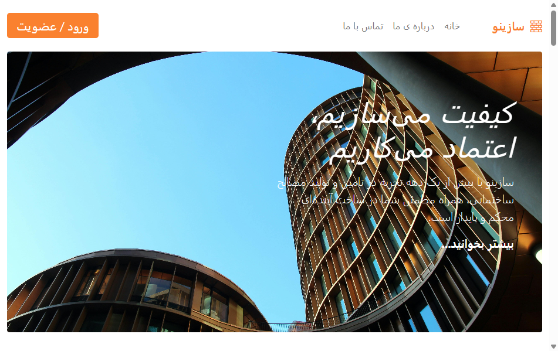
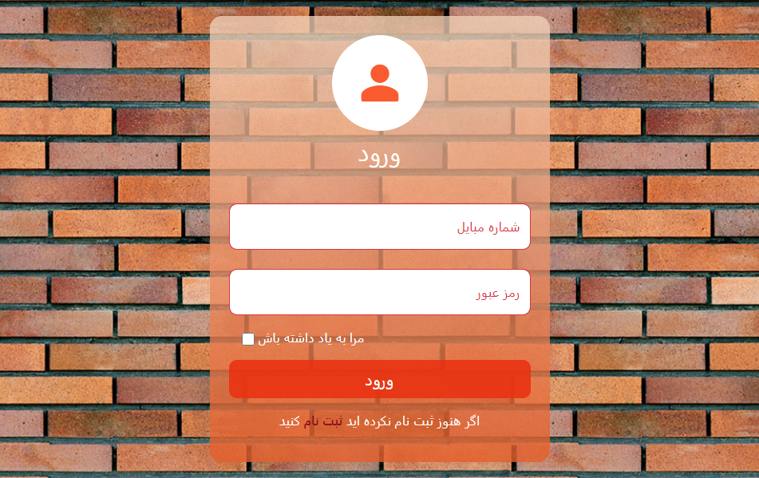
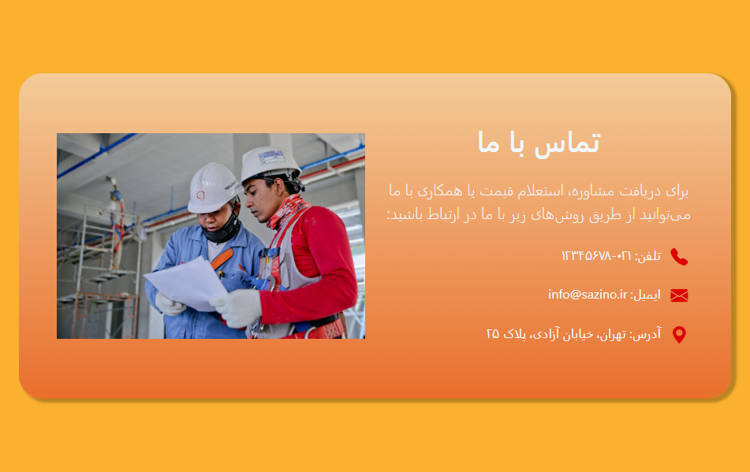
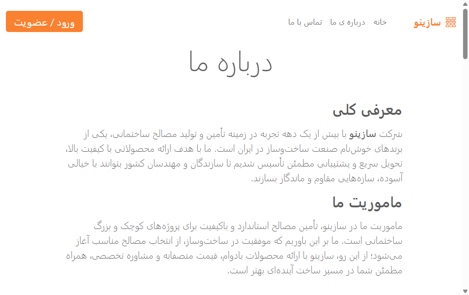

<div align="center">
  <div align="center">
  
</div>

  <br/>
  
# 🏢 Sazino Corporate Website

[](https://developer.mozilla.org/en-US/docs/Web/HTML)
[](https://developer.mozilla.org/en-US/docs/Web/CSS)
[](https://developer.mozilla.org/en-US/docs/Web/JavaScript)
[](https://getbootstrap.com)
</div>
<br/>
<details> <summary><b> English –  Click to expand</b></summary>
  <br/>
  
> A fully responsive and modern corporate website designed for the **Sazino Company**. This project showcases a professional online presence with a clean UI, smooth interactions, and a user-friendly experience — all powered by pure front-end technologies.

---

## 🌟 Key Features

- **Modern & Responsive Design**: Built with a mobile-first approach, ensuring seamless experience across all devices.
- **Multi-Page Structure**: Includes a dedicated homepage, about-us, and contact-us pages.
- **Interactive Elements**:
  - A functional login page with client-side validation (`login.html` + `login.js`).
  - Dynamic components powered by custom JavaScript (`script.js`).
- **Optimized Assets**: Utilizes organized folders for images (`img/`) and vector graphics (`svgs/`) for fast loading.
- **Clean & Maintainable Code**: Well-structured HTML, CSS, and JavaScript following best practices.

---

## 🛠️ Tech Stack

| Technology | Purpose |
| :--- | :--- |
| **HTML5** | Semantic structure and content |
| **CSS3** | Custom styling and responsive layouts |
| **JavaScript** | Interactivity and dynamic functionality |
| **Bootstrap** | UI components and grid system for enhanced responsiveness |

---

## 🚀 Getting Started

To get a local copy up and running, follow these simple steps:

1. **Clone the repository:**
   ```bash
   git clone https://github.com/rita00st/sazino-website.git
   ```
2. **Navigate to the project folder:**
   ```bash
   cd sazino-website
   ```
3. **Open the main file:**
   Simply open `sazino_site.html` in your browser. No build tools or installations are required!

---

## 📸 Screenshots

<div align="center">
  <table>
    <tr>
      <td align="center"><b>🏠 Home Page</b></td>
      <td align="center"><b>📋 Login Page</b></td>
    </tr>
    <tr>
      <td></td>
      <td></td>
    </tr>
    <tr>
      <td align="center"><b>☎️ Contact Us Page</b></td>
      <td align="center"><b>📝 About Us Page</b></td>
    </tr>
    <tr>
      <td></td>
      <td></td>
    </tr>
  </table>
</div>

<br/>

---

## 📂 Project Structure

```
sazino-website/
├── img/                    # Image assets
├── svgs/                   # SVG vector graphics
├── about-us.html           # About Us page
├── contact-us.html         # Contact Us page
├── login.html              # Login page
├── login.js                # Login page JavaScript
├── sazino_site.html        # Main homepage
├── script.js               # Global JavaScript
├── style.css               # Global stylesheets
└── README.md               # Project documentation
```

---

## 🎯 Future Improvements

- [ ] Integrate a backend (Node.js or ASP.NET Core) for dynamic content and form handling.
- [ ] Add a contact form with email sending capability.
- [ ] Implement a blog/news section.
- [ ] Enhance accessibility (ARIA labels, semantic HTML).
- [ ] Add unit tests for JavaScript components.

---

## 🤝 Contributing

Contributions are what make the open-source community such an amazing place to learn, inspire, and create. Any contributions you make are **greatly appreciated**.

1. Fork the Project
2. Create your Feature Branch (`git checkout -b feature/AmazingFeature`)
3. Commit your Changes (`git commit -m 'Add some AmazingFeature'`)
4. Push to the Branch (`git push origin feature/AmazingFeature`)
5. Open a Pull Request

---

## 📬 Contact

- **GitHub**: [@rita00st](https://github.com/rita00st)
- **Email**: mahbobeh138383@gmail.com

---

⭐ If you like this project, please give it a star! ⭐
---
</details>


<details>
<summary><b>🇮🇷 فارسی (Persian) – کلیک کنید</b></summary>
  
<br/>

> یک وب‌سایت شرکتی مدرن، کاملاً واکنش‌گرا و حرفه‌ای که برای **شرکت سازینو** طراحی شده است. این پروژه یک حضور آنلاین حرفه‌ای را با ظاهری تمیز، تعاملات روان و تجربه‌ی کاربری دوست‌داشتنی به نمایش می‌گذارد — تماماً با استفاده از تکنولوژی‌های سمت کاربر (فرانت‌اند).

---

## ✨ ویژگی‌های اصلی

- **طراحی مدرن و واکنش‌گرا**: ساخته شده با رویکرد موبایل‌محور برای تجربه‌ی یکپارچه در تمام دستگاه‌ها.
- **ساختار چند صفحه‌ای**: شامل صفحه‌ی اصلی، درباره‌ی ما، و تماس با ما.
- **عناصر تعاملی**:
  - صفحه‌ی ورود با اعتبارسنجی سمت کاربر (`login.html` + `login.js`).
  - بخش‌های پویا با جاوااسکریپت سفارشی (`script.js`).
- **بهینه‌سازی دارایی‌ها**: استفاده از پوشه‌های سازمان‌یافته برای تصاویر (`img/`) و گرافیک‌های برداری (`svgs/`) برای بارگذاری سریع.
- **کد تمیز و قابل نگهداری**: ساختار منظم HTML، CSS و جاوااسکریپت بر اساس بهترین روش‌ها.

---

## 🛠️ تکنولوژی‌های استفاده شده

| تکنولوژی | کاربرد |
| :--- | :--- |
| **HTML5** | ساختار و محتوای معنایی |
| **CSS3** | استایل‌دهی سفارشی و چیدمان واکنش‌گرا |
| **JavaScript** | تعاملات و عملکردهای پویا |
| **Bootstrap** | کامپوننت‌های UI و سیستم گرید برای واکنش‌گرایی بهتر |

---

## 🚀 نحوه‌ی اجرا

برای دریافت یک کپی محلی و اجرای آن، این مراحل ساده را دنبال کنید:

1.  **کلون کردن مخزن:**
    ```bash
    git clone https://github.com/rita00st/sazino-website.git
    ```
2.  **رفتن به پوشه‌ی پروژه:**
    ```bash
    cd sazino-website
    ```
3.  **باز کردن فایل اصلی:**
    کافی است فایل `sazino_site.html` را در مرورگر خود باز کنید. هیچ ابزار ساخت یا نصب‌افزاری نیاز نیست!

---

## 📸 پیش‌نمایش


<div align="center">
  <table>
    <tr>
      <td align="center"><b>🏠 صفحه اصلی</b></td>
      <td align="center"><b>📋 صفحه ورود</b></td>
    </tr>
    <tr>
      <td></td>
      <td></td>
    </tr>
    <tr>
      <td align="center"><b>☎️ صفحه تماس با ما</b></td>
      <td align="center"><b>📝 صفحه درباره ی ما</b></td>
    </tr>
    <tr>
      <td></td>
      <td></td>
    </tr>
  </table>
</div>

<br/>


## 📂 ساختار پروژه

```
sazino-website/
├── img/                    # دارایی‌های تصویری
├── svgs/                   # گرافیک‌های برداری SVG
├── about-us.html           # صفحه‌ی درباره‌ی ما
├── contact-us.html         # صفحه‌ی تماس با ما
├── login.html              # صفحه‌ی ورود
├── login.js                # جاوااسکریپت صفحه‌ی ورود
├── sazino_site.html        # صفحه‌ی اصلی وب‌سایت
├── script.js               # جاوااسکریپت عمومی
├── style.css               # استایل‌های عمومی
└── README.md               # مستندات پروژه
```

---

## 🎯 بهبودهای آینده

- [ ] اضافه کردن بک‌اند (Node.js یا ASP.NET Core) برای محتوای پویا و مدیریت فرم‌ها.
- [ ] اضافه کردن فرم تماس با قابلیت ارسال ایمیل.
- [ ] ایجاد بخش وبلاگ/اخبار.
- [ ] بهبود دسترسی‌پذیری (برچسب‌های ARIA، HTML معنایی).
- [ ] اضافه کردن تست‌های واحد برای کامپوننت‌های جاوااسکریپت.

---

## 🤝 مشارکت

مشارکت‌ها چیزی هستند که جامعه‌ی متن‌باز را به یک مکان شگفت‌انگیز برای یادگیری، الهام‌بخشی و خلاقیت تبدیل می‌کند. هر مشارکتی **بسیار قدردانی می‌شود**.

1.  پروژه را فورک کنید
2.  شاخه‌ی ویژگی خود را ایجاد کنید (`git checkout -b feature/AmazingFeature`)
3.  تغییرات خود را کامیت کنید (`git commit -m 'Add some AmazingFeature'`)
4.  به شاخه پوش کنید (`git push origin feature/AmazingFeature`)
5.  یک درخواست کشش (Pull Request) باز کنید

---

## 📬 ارتباط با من

- **گیت‌هاب**: [@rita00st](https://github.com/rita00st)
- **ایمیل**: mahbobeh138383@gmail.com

---
⭐ اگر از این پروژه خوشتان آمد، به آن ستاره دهید! ⭐

</details>

<br/>
<br/>
<div align="center">
  <p>
    <i>Made with ❤️ and ☕ in Iran</i>
  </p>
  <p>
    <i>«Write code, live beautifully, and help others.»</i>
  </p>
</div>
